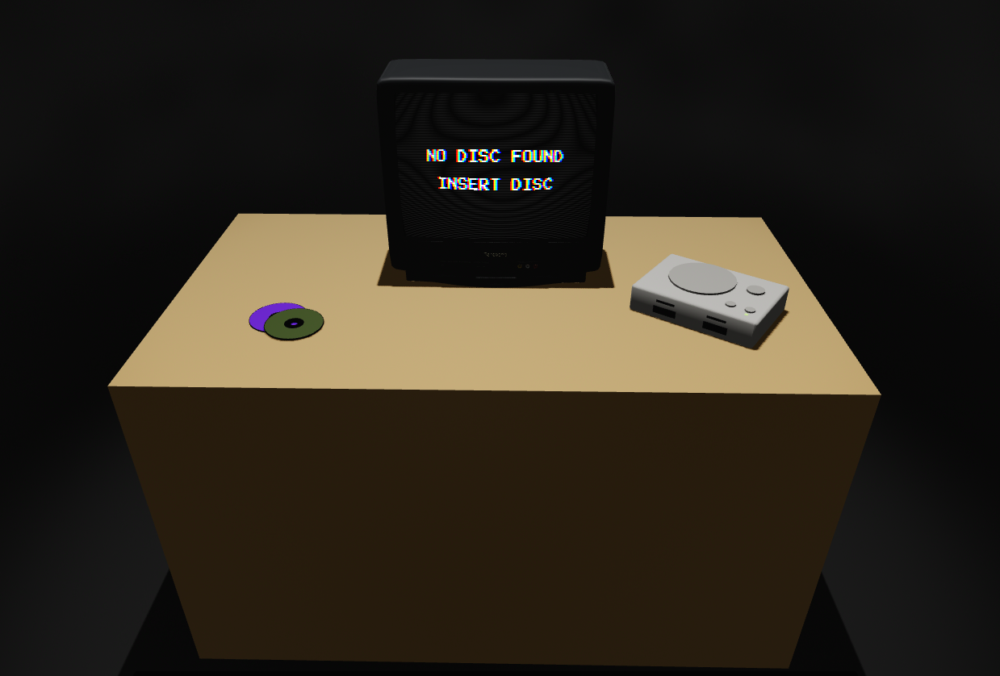
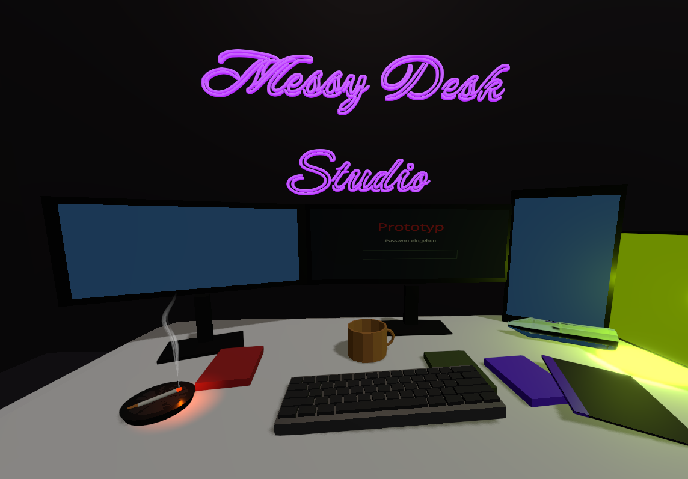
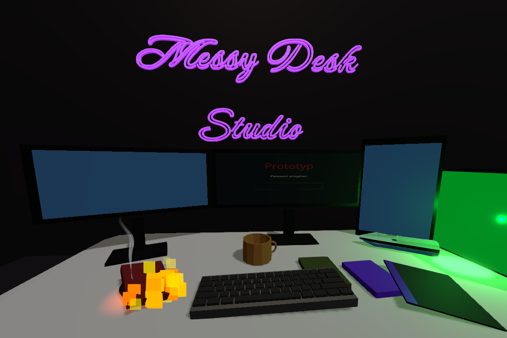
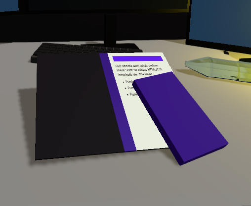

# Messy Desk Studio

This is my personal playground for experimenting with 3D websites and, at the same time, a portfolio to show some of my work.

More screenshots

**🌐 Live: [messy-desk-studio.de](https://messy-desk-studio.de)**

## About

I mainly created it to have a place where I can deploy builds of my Unity projects, like GridFinder and, in the future, CargoKing. Since I also really like CI/CD development, this project was born.

My technical background is heavily anchored in XR development, so I challenged myself to use as few "pancake" UI elements as possible. The goal is to create a 3D website that is navigated through 3D interactions.

During development, I realized that the web comes with a completely new and unique set of requirements that I hadn't faced before – like the desktop vs. mobile split and different input devices such as mouse + keyboard or trackpads. The current state of the project has a heavy focus on mouse + keyboard. I am still working on a solution for mobile and trackpad users.

*Best experienced with mouse and keyboard at the moment.*

## Features and Experience

- Grab, throw and rotate objects in the 3D scenes with the mouse – all scenes have real-time physics
- A tutorial scene as the first landing page: fewer objects and an easy-to-understand real-world scenario, so users can explore the interactions without a heavily guided tutorial
- Very basic riddles, e.g. a "login" in the `MessyDeskScene` that unlocks the download of a deployed prototype build of GridFinder
- Things catch fire – and the fire spreads from one burning object to the next
- A binder that displays a conventional web page inside the 3D scene

## Technical Highlights

### Binder – HTML Inside the 3D Scene

- Two stacked renderers: a `CSS3DRenderer` layer below the WebGL canvas
- The `CSS3DRenderer` renders real DOM elements and transforms them via CSS `transform`, using the main camera matrix of the 3D scene
- An invisible plane at the page's position writes fully transparent pixels with `NoBlending` and punches a hole into the canvas of the 3D scene, so the HTML layer shows through
- The occluder writes to the depth buffer, so 3D objects in front of the binder correctly cover the HTML page
- The page content is rendered via `createRoot` into its own `div`, i.e. normal React components styled with normal CSS

  

## Tech Stack

### 3D

- **three.js** – the 3D engine on top of WebGL. Handles meshes, materials, lights, the camera and custom shaders
- **React Three Fiber** – three.js as React components, so every object is its own component with its own state
- **drei** – ready-made R3F helpers: `useGLTF` (models), `Text`, `RenderTexture` (monitor login screen), `TransformControls` (editor), `useProgress` (loading)
- **postprocessing** – screen effects: `Bloom` for glowing neon, embers and fire, `SMAA` for anti-aliasing

### Physics

- **Rapier** – a fast physics engine written in Rust and running as WebAssembly. It handles gravity, collisions and friction for grabbing, throwing, respawning, CD snapping and fire spreading on contact

### Web

- **React** – the base for R3F and for the regular HTML UI (top bar, scene transitions, binder page)

### Tooling

- **TypeScript** – catches bugs at compile time, which helps a lot with three.js refs and vectors
- **Vite** – dev server with hot reload and the production build; also handles assets and env variables
- **ESLint** – static code checks, especially the React hooks rules

### Why This Combination

- R3F keeps many interactive objects manageable, where plain three.js gets messy
- Rapier is modern and fast, with first-class R3F bindings
- Vite is the fast, current standard
- R3F, drei, postprocessing and the Rapier bindings all come from the same ecosystem (pmndrs), so they fit together

## Credits

- ["CRT TV"](https://sketchfab.com/3d-models/crt-tv-9ba4baa106e64319a0b540cf0af5aa9e) 3D model by
  [Timothy Ahene](https://sketchfab.com/timothyahene) – Sketchfab Free Standard License.
  The copy in this repo is a compressed version for this website only and is not licensed
  for reuse – if you want to use the model, download it from
  [Sketchfab](https://sketchfab.com/3d-models/crt-tv-9ba4baa106e64319a0b540cf0af5aa9e).
- [Press Start 2P](https://fonts.google.com/specimen/Press+Start+2P) font –
  © 2012 The Press Start 2P Project Authors, SIL Open Font License 1.1
- [Caveat](https://fonts.google.com/specimen/Caveat) font –
  © 2014 The Caveat Project Authors, SIL Open Font License 1.1
- All other 3D models and assets made by me

## License

© 2026 Messy Desk Studio / DerKunde. All rights reserved.
The source code is public for reference only. Third-party assets remain under their own
licenses (see Credits).
